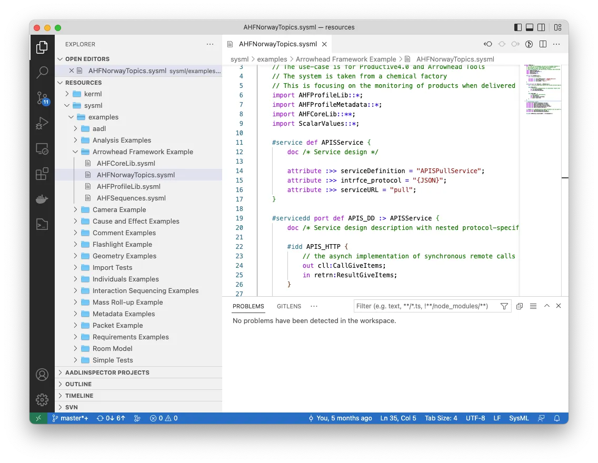
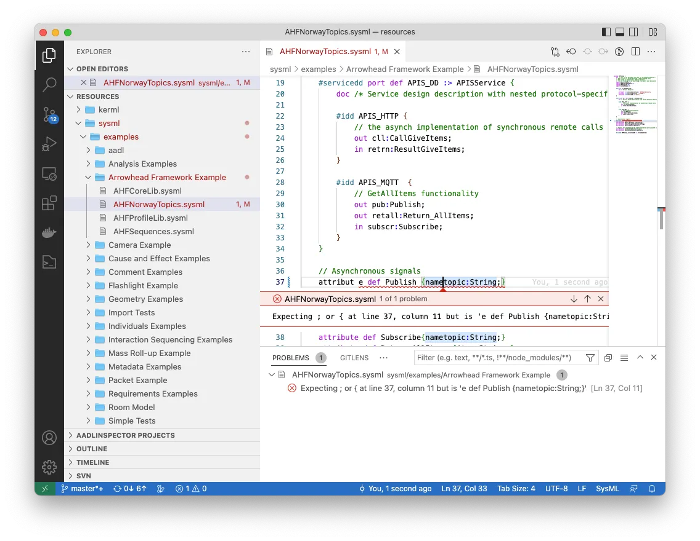
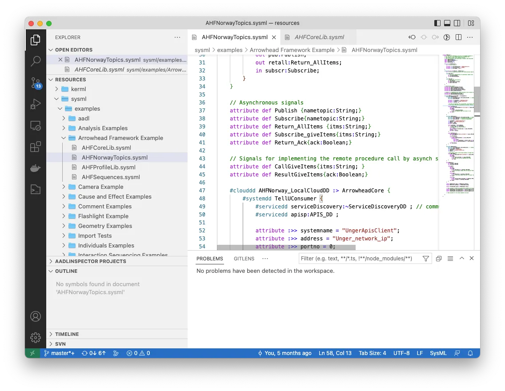

# SysML v2 support for Visual Studio Code

<table>
<tr>
<td>
    

      <b>This extension is in active development and follows the monthly release of the <a href="https://github.com/Systems-Modeling/SysML-v2-Release">SysML v2 specification</a>.</b>
    

    

    Edit your SysML v2 model with the Visual Studio Code SysML v2 extension.
    

    

    This extension adds full textual support for SysML v2 files into Visual Studio Code, including features such as syntax highlighting, error detection, reference navigation. It supports the release 2024-11 release of the <a href="https://github.com/Systems-Modeling/SysML-v2-Release">SysML v2 specification</a>.
    

    

    This extension is provided free of charge by <a href="https://www.ellidiss.com">Ellidiss Technologies</a>.
    

    

    For any question, problem or new requirements, please contact us at <a href="mailto:support@ellidiss.com">support@ellidiss.com</a>.
</td>
<td width="30%">  </td>
</tr>
</table>

## Content

- [Features](#Features)
- [Release Notes](#Release-Notes)

## Features

This extension contains a full SysML v2 textual parser allowing error detection. It detects syntax parsing errors and presents them. It parses and checks errors in all opened files and files in the current workspaces. The reference resolution works across files and uses all parsed files in the workspaces.

The resolved references by the parser are navigable in Visual Studio Code. Both by `Ctrl+Click` (or `Cmd+Click` on MacOS) to go to the definition or using *Go to References* or *Find all References*

## Under development features

This extension is in active development and follows the monthly release of the [SysML v2 specification](https://github.com/Systems-Modeling/SysML-v2-Release). Many features are under development:

- [x] Support for SysML textual syntax.
  - [x] syntax highlighting.
  - [x] parsing and error detection.
  - [x] reference resolution and navigation.
- [x] Support for KerML textual syntax.
  - [x] syntax highlighting.
  - [x] parsing and error detection.
  - [x] reference resolution and navigation.
- [ ] Full list of symbol presentation and files outline.
- [ ] Support for documentation presentation in a hover popup.
- [ ] Reference resolution error presentation.
- [ ] Rename symbol action.
- [x] Prolog facts generation.

## Release Notes

### [0.6.0]

- Updates from SysML release 2024-11

### [0.5.0]

- Updates from SysML release 2024-02
- Increased performance (especially at startup)

### [0.4.3]

- Better parsing performance.

### [0.4.2]

- Adds prolog fact export

### [0.4.1]

- Fix bug not showing parsing errors

### [0.4.0]

- Adds support for KerML files
- Updates from SysML until release 2024-01

### [0.3.0]

- Better error positions
- Updates from SysML release 2022-12.
- Updates from SysML release 2022-11.

### [0.2.0]

- Updates from SysML release 2022-10.
- Updates from SysML release 2022-09.
  - Changed asynchronous messaging through ports to use "send via".
  - Added "library package" to language extension example.
  - Changed "as" to "meta" in semantic metadata example.
  - Declared all standard model library packages using "standard library package".

### [0.1.2]

Initial release of `sysml-ellidiss`
